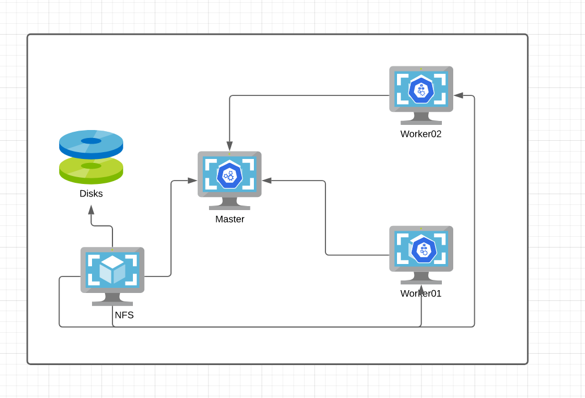

# Despliegue de cluster Kubernetes con Ansible, Terraform y Vagrant.

Este repositorio fué creado inicialmente como resolución del Trabajo práctico Nº. 2 de Experto Univesitario de UNIR. 

## Despliegue de componentes 


 
 -----------------------------------------------------------------
| Rol | Sistema Operativo | vCPUs | Memoria (GiB) | Disco Duro |  DNS | IP |
|------|-------------------|-------|---------------|------------| ----------- | --------------|
| NFS  | CentOS 8.3          | 2     | 4             | 1 x 20 GiB (boot), 1 x 10 GiB (data) | nfs.acme.es  | 192.168.2.115/24
| Master | CentOS 8.3        | 2     | 8             | 1 x 20 GiB (boot) | master.acme.es  | 192.168.2.110/24
| Worker 01 | CentOS 8.3        | 2     | 4             | 1 x 20 GiB (boot) |  worker01.acme.es | 192.168.2.111/24 | 
| Worker02 | CentOS 8.3        | 2     | 4             | 1 x 20 GiB (boot) |  worker02.acme.es | 192.168.2.112/24 | 
| Bastion | CentOS 8.3        | 2     | 4             | 1 x 20 GiB (boot) |  n/a | n/a | 


Nota: El bastión solo se despliega en la nube. 

## Requerimientos de software

Para la versión local: 

* Virtual Box.
* Vagrant. 
* Ansible. 
* Python.

Para la versión en Azure:
* Ansible. 
* Terraform.
* Azure cli. 
* Python.

Para verificar los requerimientos podemos usar ejecutar: 

```
$ make checkReq
```
## ¿Dónde puedo declarar la infrastructura en local?

El archivo [Vagrantfile](Vagrantfile) dispone de una variable:
```
nodes = [
  { :hostname => 'master',   :ip => '192.168.2.110', :box => 'centos/8', :ram => 2000, :dns => 'master master.acme.es'},
  { :hostname => 'worker01',      :ip => '192.168.2.111', :box => 'centos/8', :ram => 1000 , :dns => 'worker01 worker01.acme.es' },
  { :hostname => 'worker02',    :ip => '192.168.2.112', :box => 'centos/8' , :ram => 1000,  :dns => 'worker02 worker02.acme.es5' },
  { :hostname => 'nfs',    :ip => '192.168.2.115', :box => 'centos/8' , :ram => 1000 ,  :dns => 'nfs nfs.acme.es' },
]
```

## Despliegue local (Vagrant & VirtualBox )

```
$ make local up
```

## Despliegue local (Ansible)

```
$ make local softwareInstall
```


## Despliegue en Azure 

Creación de la cuenta de Azure. 

## Configuración de credenciales 

Recomendamos seguir los siguientes [pasos](https://registry.terraform.io/providers/hashicorp/azurerm/latest/docs/guides/service_principal_client_secret) para la creación de la service principal account. 

Los datos de logueos se deben guardar en un archivo llamado *azcreds.json*, de esta manera el siguiente comando configurará tu shell para su uso. 

Ejemplo  del archivo json de credenciales: 

```
{
  "appId": "42356afe-988d398d",
  "displayName": "azur-05-59",
  "name": "http://azur5-59",
  "password": "7eh2ftGdGHyhyo7N",
  "tenant": "899789dc-b440"
}
```


```
$ make azuresetupCreds
```

## Terraform 

Para inicializar el proyecto debemos ejecutar: 


```
$ make terraformUp
```
## ¿Dónde puedo declarar la infrastructura en Azure?

Mirar el directorio [terraform](terraform).

## Generación de SSH keypair 

Este par de claves son importantes para que Terraform pueda conectarse al bastión, y eventualmente nosotros tambien lo podremos hacer:

Nota: versión local se puede agregar la clave publica en playbooks/group_vars/common.yaml para poder acceder a los nodos 
```
$ make setupSshKeyPair
```


## Automatizaciones con Terraform 
Si queremos hacer un plan de cambios: 

```
$ make terraformPlan
```

O simplemente podemos destruir todo con el siguiente comando: 


```
$ make terraformDestroy
```

## Ansible  

Si quisiéramos que Terraform aplique cambios realizados a los playbook: 

```
$ make terraformRunPlaybooks 
```

## Despliegue de apps en Kubernetes: 

```
$ make appsReDeploy 
```

Si deseamos desplegar cambios en apps por entorno:


```
$ make appsReDeploy  desarrollo
```

```
$ make appsReDeploy  produccion
```
